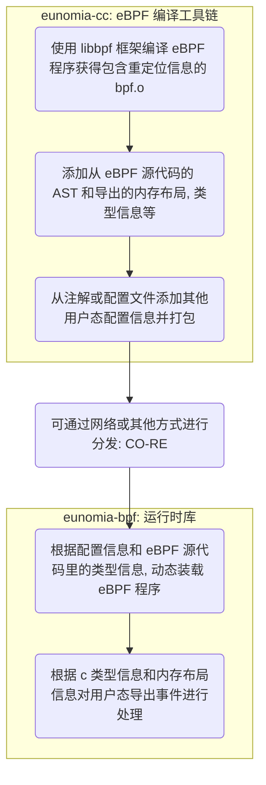

# eunomia-bpf 用户手册: 让 eBPF 程序的开发和部署尽可能简单

传统来说， eBPF 的开发方式主要有 BCC、libbpf 等方式。要完成一个 BPF 二进制程序的开发，
需要搭建开发编译环境，要关注目标系统的内核版本情况，需要掌握从 BPF 内核态到用户态程序的编写，
以及如何加载、绑定至对应的 HOOK 点等待事件触发，最后再对输出的日志及数据进行处理。

我们希望有这样一种 eBPF 的编译和运行工具链，就像其他很多语言一样：

- 大多数用户只需要关注 `bpf.c` 程序本身的编写，不需要写任何其他的什么 Python, Clang 之类的用户态辅助代码框架；
  这样我们可以很方便地分发、重用 eBPF 程序本身，而不需要和某种或几种语言的生态绑定；

- 编译和运行完全分离，原生支持远程编译和 CO-RE（Compile Once-Run Everywhere），不需要关心内核版本问题，
  也可以不用关心环境搭建，比如可以在 GitHub 网页上编辑，然后直接使用 GitHub Actions 进行编译，编译好之后一行命令就可以在本地运行；

- 本地只需要下载一个很小的二进制运行时，没有任何的 Clang LLVM 之类的大型依赖，可以支持热插拔、热更新；
  也可以作为 Lua 虚拟机那样的小模块直接编译嵌入其他的大型软件中，提供 eBPF 程序本身的服务；运行和启动时资源占用率都很低；

- 让 eBPF 程序的分发和使用像网页和 Web 服务一样自然（Make eBPF as a service）：
  支持在集群环境中直接通过一次请求进行分发和热更新，仅需 <100 KiB 的 payload，
  <10 0ms 的更新时间，和少量的 CPU 内存占用即可完成 eBPF 程序的分发、部署和更新；
  不需要执行额外的编译过程，就能得到 CO-RE 的运行效率；

## 从 _C 语言_ 的 Hello World 开始

还记得您第一次写 _C 语言_ 的 **Hello World 程序** 吗？首先，我们需要一个 `.c` 文件，它包含一个 `main` 函数：

```c
int main(void)
{
    printf("Hello, World!\n");
    return 0;
}
```

我们叫它 `hello.c`，接下来就只需要这几个步骤就好：

```bash
# if you are using Ubuntu without a c compiler
sudo apt insalll build-essentials
# compile the program
gcc -o hello hello.c
# run the program
./hello
```

只需要写一个 c 文件，执行两行命令就可以运行；大多数情况下你也可以把编译好的可执行文件直接移动到其他同样架构的机器或不同版本的操作系统上，然后运行它，也会得到一样的结果:

```plaintext
Hello World!
```

## eunomia-bpf 的 Hello World

首先，我们需要一个 `bpf.c` 文件，它就是正常的、合法的 C 语言代码，和 libbpf 所使用的完全相同：

```c
#include <linux/bpf.h>
#include <bpf/bpf_helpers.h>
#include <bpf/bpf_tracing.h>

typedef int pid_t;

char LICENSE[] SEC("license") = "Dual BSD/GPL";

SEC("tp/syscalls/sys_enter_write")
int handle_tp(void *ctx)
{
 pid_t pid = bpf_get_current_pid_tgid() >> 32;
 bpf_printk("BPF triggered from PID %d.\n", pid);
 return 0;
}
```

假设它叫 `hello.bpf.c`，并且假设他在 `/path/to/repo` 目录下，接下来的步骤：

[Install](install.md#install)

```console
$ # 下载安装 ecli 二进制
$ wget https://aka.pw/bpf-ecli -O /usr/local/ecli && chmod +x /usr/local/ecli
$ # 使用容器进行编译，生成一个 package.json 文件，里面是已经编译好的代码和一些辅助信息
$ docker run -it -v /path/to/repo:/src yunwei37/ebpm:latest
$ # 运行 eBPF 程序（root shell）
# cat package.json | ecli run
```

> 使用 docker 的时候需要把包含 .bpf.c 文件的目录挂载到容器的根目录下，这样才能让 eBPF 程序运行；

它会追踪所有进行 write 系统调用的进程的 pid：

```console
# cat /sys/kernel/debug/tracing/trace_pipe
cat-42755   [003] d...1 48755.529860: bpf_trace_printk: BPF triggered from PID 42755.
             cat-42755   [003] d...1 48755.529874: bpf_trace_printk: BPF triggered from PID 42755.
```

我们编译好的 eBPF 代码同样可以适配多种内核版本，可以直接把 package.json 复制到另外一个机器上，然后不需要重新编译就可以直接运行（CO-RE：Compile Once Run Every Where）；也可以通过网络传输和分发 package.json，通常情况下，压缩后的版本只有几 kb 到几十 kb。

## 添加 map

参考：<https://github.com/eunomia-bpf/eunomia-bpf/tree/master/bpftools/examples/bootstrap>

```c

struct {
 __uint(type, BPF_MAP_TYPE_HASH);
 __uint(max_entries, 8192);
 __type(key, pid_t);
 __type(value, u64);
} exec_start SEC(".maps");

```

添加 map 的功能和 libbpf 没有任何区别，只需要在 .bpf.c 中定义即可。

## 使用 ring buffer 往用户态发送数据

参考：<https://github.com/eunomia-bpf/eunomia-bpf/tree/master/bpftools/examples/bootstrap>

只需要定义一个头文件，包含你想要发送给用户态的数据格式，以 `.bpf.h` 作为后缀名：

```c
/* SPDX-License-Identifier: (LGPL-2.1 OR BSD-2-Clause) */
/* Copyright (c) 2020 Facebook */
#ifndef __BOOTSTRAP_H
#define __BOOTSTRAP_H

#define TASK_COMM_LEN 16
#define MAX_FILENAME_LEN 127

struct event {
 int pid;
 int ppid;
 unsigned exit_code;
 unsigned long long duration_ns;
 char comm[TASK_COMM_LEN];
 char filename[MAX_FILENAME_LEN];
 unsigned char exit_event;
};

#endif /* __BOOTSTRAP_H */
```

在代码中定义环形缓冲区之后，就可以直接使用它：

```c
struct {
 __uint(type, BPF_MAP_TYPE_RINGBUF);
 __uint(max_entries, 256 * 1024);
} rb SEC(".maps");

SEC("tp/sched/sched_process_exec")
int handle_exec(struct trace_event_raw_sched_process_exec *ctx)
{
    ......
 e->exit_event = false;
 e->pid = pid;
 e->ppid = BPF_CORE_READ(task, real_parent, tgid);
 bpf_get_current_comm(&e->comm, sizeof(e->comm));
 /* successfully submit it to user-space for post-processing */
 bpf_ringbuf_submit(e, 0);
 return 0;
}
```

eunomia-bpf 会自动去源代码中找到对应的 ring buffer map，并且把 ring buffer 和类型信息记录在编译好的信息中，并在运行的时候自动完成对于 ring buffer 的加载、导出事件等工作。所有的 eBPF 代码和原生的 libbpf 程序没有任何区别，使用 eunomia-bpf 开发的代码也可以在 libbpf 中无需任何改动即可编译运行。

## 实现原理

eunomia-bpf 主要分为两个部分：

一个运行时库 `eunomia-bpf`：<https://github.com/eunomia-bpf/eunomia-bpf>
一个 eBPF 编译工具链 `eunomia-cc`：<https://github.com/eunomia-bpf/eunomia-cc>



## 使用 github-template 实现远程编译

由于 eunomia-bpf 的编译和运行阶段完全分离，可以实现在 github 网页上编辑之后，通过 github actions 来完成编译，之后在本地一行命令即可启动：

1. 将此 [github.com/eunomia-bpf/ebpm-template](https://github.com/eunomia-bpf/ebpm-template) 用作 github 模板：请参阅 [creating-a-repository-from-a-template](https://docs.github.com/en/repositories/creating-and-managing-repositories/creating-a-repository-from-a-template)
2. 修改 bootstrap.bpf.c， commit 并等待工作流停止
3. 我们配置了 github pages 来完成编译好的 json 的导出，之后就可以实现 ecli 使用远程 url 一行命令即可运行：

```sh
sudo ./ecli run https://eunomia-bpf.github.io/ebpm-template/package.json
```

## 使用说明

1. 我们使用与 libbpf 相同的 c eBPF 代码，因此大多数 libbpf eBPF c 代码无需任何修改即可运行。
2. 支持的 eBPF 程序类型：`kprobe`, `tracepoint`, `fentry`, 未来我们会增加更多类型。
3. 如果你想使用环形缓冲区来导出事件，你需要添加 `your_program.bpf.h` 到你的 repo，并在其中定义导出数据类型，导出数据类型应该是 C struct，例如：

   ```c
   struct process_event {
       int pid;
       int ppid;
       unsigned exit_code;
       unsigned long long duration_ns;
       char comm[TASK_COMM_LEN];
       char filename[MAX_FILENAME_LEN];
       int exit_event;
   };
   ```

   导出的名称和字段类型不受限制，但最好使用标准 C 类型。如果标头中存在多个 struct，我们现阶段将使用第一个作为导出的数据类型。仅当我们发现 eBPF 程序中存在 `BPF_MAP_TYPE_RINGBUF` 的 map 时，才启用环形缓冲区导出的功能。

4. 目前部分低版本内核对于 eBPF 模块的支持并不完善，同时也可能没有附带 BTF 信息，因此有可能一些 eBPF 程序在低版本内核上运行时不能得到预期的结果。详情请参考 libbpf 对应的文档：[libbpf/libbpf](https://github.com/libbpf/libbpf) 我们未来会在这方面继续提升兼容性。

## 为我们的项目添加测试

我们的项目还在早期阶段，因此非常希望有您的帮助：

- 运行时库地址：<https://github.com/eunomia-bpf/eunomia-bpf>
- 编译器地址：<https://github.com/eunomia-bpf/eunomia-cc>
- gitee 镜像：<https://gitee.com/anolis/eunomia>
- 文档：<https://github.com/eunomia-bpf/eunomia-bpf.github.io>

您可以帮助我们添加测试或者示例，可以参考：

- <https://github.com/eunomia-bpf/eunomia-bpf/tree/master/bpftools/examples>
- <https://github.com/eunomia-bpf/eunomia-bpf/tree/master/bpftools/tests>

由于现在 API 还不稳定，如果您在试用中遇到任何问题或者任何流程/文档不完善的地方，请在 gitee 或 github issue 留言，
我们会尽快修复；也非常欢迎进一步的 PR 提交和贡献！也非常希望您能提出一些宝贵的意见或者建议！
