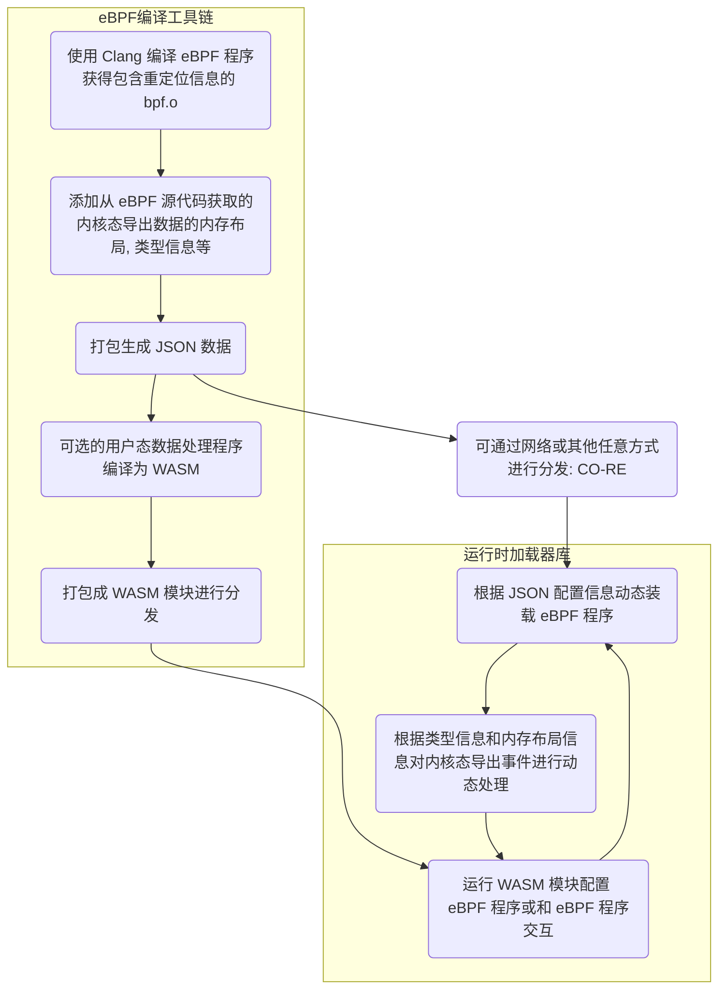

# eunomia-bpf 用户手册: 让 eBPF 程序的开发和部署尽可能简单

<!-- TOC -->

- [从 _C 语言_ 的 Hello World 开始](#从-c-语言-的-hello-world-开始)
- [eunomia-bpf 的 Hello World](#eunomia-bpf-的-hello-world)
- [添加 map 记录数据](#添加-map-记录数据)
- [使用 ring buffer 往用户态发送数据](#使用-ring-buffer-往用户态发送数据)
- [使用 perf event array 往用户态发送数据](#使用-perf-event-array-往用户态发送数据)
- [使用 github-template 实现远程编译](#使用-github-template-实现远程编译)
- [通过 API 进行热插拔和分发](#通过-api-进行热插拔和分发)
- [使用 Prometheus 或 OpenTelemetry 进行可观测性数据收集](#使用-prometheus-或-opentelemetry-进行可观测性数据收集)
  - [example](#example)
- [使用 WASM 模块分发、动态加载 eBPF 程序](#使用-wasm-模块分发动态加载-ebpf-程序)
- [使用 WASM 开发和打包 eBPF 程序](#使用-wasm-开发和打包-ebpf-程序)
- [演示视频](#演示视频)
- [原理](#原理)
- [为我们的项目贡献代码](#为我们的项目贡献代码)

<!-- /TOC -->

传统来说， eBPF 的开发方式主要有 BCC、libbpf 等方式。要完成一个 BPF 二进制程序的开发，需要搭建开发编译环境，要关注目标系统的内核版本情况，需要掌握从 BPF 内核态到用户态程序的编写，以及如何加载、绑定至对应的 HOOK 点等待事件触发，最后再对输出的日志及数据进行处理。

我们希望有这样一种 eBPF 的编译和运行工具链，就像其他很多语言一样：

- 大多数用户只需要关注 `bpf.c` 程序本身的编写，不需要写任何其他的什么 Python, Clang 之类的用户态辅助代码框架；
  这样我们可以很方便地分发、重用 eBPF 程序本身，而不需要和某种或几种语言的生态绑定；

- 最大程度上和主流的 libbpf 框架实现兼容，原先使用 libbpf 框架编写的代码几乎不需要改动即可移植；eunomia-bpf 编写的 eBPF 程序也可以使用 libbpf 框架来直接编译运行；

- 本地只需要下载一个很小的二进制运行时，没有任何的 Clang LLVM 之类的大型依赖，可以支持热插拔、热更新；
  也可以作为 Lua 虚拟机那样的小模块直接编译嵌入其他的大型软件中，提供 eBPF 程序本身的服务；运行和启动时资源占用率都很低；

- 让 eBPF 程序的分发和使用像网页和 Web 服务一样自然（Make eBPF as a service）：
  支持在集群环境中直接通过一次请求进行分发和热更新，仅需数十 kB 的 payload，
  <100ms 的更新时间，和少量的 CPU 内存占用即可完成 eBPF 程序的分发、部署和更新；
  不需要执行额外的编译过程，就能得到 CO-RE 的运行效率；

## 从 _C 语言_ 的 Hello World 开始

还记得您第一次写 _C 语言_ 的 **Hello World 程序** 吗？首先，我们需要一个 `.c` 文件，它包含一个 `main` 函数：

```c
int main(void)
{
    printf("Hello, World!\n");
    return 0;
}
```

我们叫它 `hello.c`，接下来就只需要这几个步骤就好：

```bash
# if you are using Ubuntu without a c compiler
sudo apt insalll build-essentials
# compile the program
gcc -o hello hello.c
# run the program
./hello
```

只需要写一个 c 文件，执行两行命令就可以运行；大多数情况下你也可以把编译好的可执行文件直接移动到其他同样架构的机器或不同版本的操作系统上，然后运行它，也会得到一样的结果:

```plaintext
Hello World!
```

## eunomia-bpf 的 Hello World

首先，我们需要一个 `bpf.c` 文件，它就是正常的、合法的 C 语言代码，和 libbpf 所使用的完全相同：

```c
#include <linux/bpf.h>
#include <bpf/bpf_helpers.h>
#include <bpf/bpf_tracing.h>

typedef int pid_t;

char LICENSE[] SEC("license") = "Dual BSD/GPL";

SEC("tp/syscalls/sys_enter_write")
int handle_tp(void *ctx)
{
 pid_t pid = bpf_get_current_pid_tgid() >> 32;
 bpf_printk("BPF triggered from PID %d.\n", pid);
 return 0;
}
```

假设它叫 `hello.bpf.c`，新建一个 `/path/to/repo` 的文件夹并且把它放进去，接下来的步骤：

```console
# 下载安装 ecli 二进制
wget https://aka.pw/bpf-ecli -O /usr/local/ecli && chmod +x /usr/local/ecli
# 使用容器进行编译，生成一个 package.json 文件，里面是已经编译好的代码和一些辅助信息
docker run -it -v /path/to/repo:/src yunwei37/ebpm:latest
# 运行 eBPF 程序（root shell）
sudo ecli run package.json
```

> 使用 docker 的时候需要把包含 .bpf.c 文件的目录挂载到容器的 /src 目录下，目录中只有一个 .bpf.c 文件；

它会追踪所有进行 write 系统调用的进程的 pid：

```console
$ sudo cat /sys/kernel/debug/tracing/trace_pipe
cat-42755   [003] d...1 48755.529860: bpf_trace_printk: BPF triggered from PID 42755.
             cat-42755   [003] d...1 48755.529874: bpf_trace_printk: BPF triggered from PID 42755.
```

我们编译好的 eBPF 代码同样可以适配多种内核版本，可以直接把 package.json 复制到另外一个机器上，然后不需要重新编译就可以直接运行（CO-RE：Compile Once Run Every Where）；也可以通过网络传输和分发 package.json，通常情况下，压缩后的版本只有几 kb 到几十 kb。

## 添加 map 记录数据

参考：<https://github.com/eunomia-bpf/eunomia-bpf/tree/master/examples/bpftools/bootstrap>

```c

struct {
 __uint(type, BPF_MAP_TYPE_HASH);
 __uint(max_entries, 8192);
 __type(key, pid_t);
 __type(value, u64);
} exec_start SEC(".maps");

```

添加 map 的功能和 libbpf 没有任何区别，只需要在 .bpf.c 中定义即可。

## 使用 ring buffer 往用户态发送数据

参考：<https://github.com/eunomia-bpf/eunomia-bpf/tree/master/examples/bpftools/bootstrap>

只需要定义一个头文件，包含你想要发送给用户态的数据格式，以 `.bpf.h` 作为后缀名：

```c
/* SPDX-License-Identifier: (LGPL-2.1 OR BSD-2-Clause) */
/* Copyright (c) 2020 Facebook */
#ifndef __BOOTSTRAP_H
#define __BOOTSTRAP_H

#define TASK_COMM_LEN 16
#define MAX_FILENAME_LEN 127

struct event {
 int pid;
 int ppid;
 unsigned exit_code;
 unsigned long long duration_ns;
 char comm[TASK_COMM_LEN];
 char filename[MAX_FILENAME_LEN];
 unsigned char exit_event;
};

#endif /* __BOOTSTRAP_H */
```

在代码中定义环形缓冲区之后，就可以直接使用它：

```c
struct {
 __uint(type, BPF_MAP_TYPE_RINGBUF);
 __uint(max_entries, 256 * 1024);
} rb SEC(".maps");

SEC("tp/sched/sched_process_exec")
int handle_exec(struct trace_event_raw_sched_process_exec *ctx)
{
    ......
 e->exit_event = false;
 e->pid = pid;
 e->ppid = BPF_CORE_READ(task, real_parent, tgid);
 bpf_get_current_comm(&e->comm, sizeof(e->comm));
 /* successfully submit it to user-space for post-processing */
 bpf_ringbuf_submit(e, 0);
 return 0;
}
```

eunomia-bpf 会自动去源代码中找到对应的 ring buffer map，并且把 ring buffer 和类型信息记录在编译好的信息中，并在运行的时候自动完成对于 ring buffer 的加载、导出事件等工作。所有的 eBPF 代码和原生的 libbpf 程序没有任何区别，使用 eunomia-bpf 开发的代码也可以在 libbpf 中无需任何改动即可编译运行。

## 使用 perf event array 往用户态发送数据

使用 perf event 的原理和使用 ring buffer 非常类似，使用我们的框架时，也只需要在头文件中定义好所需导出的事件，然后定义一下 perf event map：

```c
struct {
 __uint(type, BPF_MAP_TYPE_PERF_EVENT_ARRAY);
 __uint(key_size, sizeof(u32));
 __uint(value_size, sizeof(u32));
} events SEC(".maps");
```

可以参考：<https://github.com/eunomia-bpf/eunomia-bpf/tree/master/examples/bpftools/opensnoop> 它是直接从 libbpf-tools 中移植的实现；

## 使用 github-template 实现远程编译

由于 eunomia-bpf 的编译和运行阶段完全分离，可以实现在 github 网页上编辑之后，通过 github actions 来完成编译，之后在本地一行命令即可启动：

1. 将此 [github.com/eunomia-bpf/ebpm-template](https://github.com/eunomia-bpf/ebpm-template) 用作 github 模板：请参阅 [creating-a-repository-from-a-template](https://docs.github.com/en/repositories/creating-and-managing-repositories/creating-a-repository-from-a-template)
2. 修改 bootstrap.bpf.c， commit 并等待工作流停止
3. 我们配置了 github pages 来完成编译好的 json 的导出，之后就可以实现 ecli 使用远程 url 一行命令即可运行：

```console
sudo ./ecli run https://eunomia-bpf.github.io/ebpm-template/package.json
```

## 通过 API 进行热插拔和分发

由于 eunomia-cc 编译出来的 ebpf 程序代码和附加信息很小（约数十 kb），且不需要同时传递任何的额外依赖，因此我们可以非常方便地通过网络 API 直接进行分发，也可以在很短的时间（大约 100ms）内实现热插拔和热更新。我们提供了一个简单的 client 和 server，请参考;

[https://github.com/eunomia-bpf/eunomia-bpf/blob/master/documents/ecli-usage.md](https://github.com/eunomia-bpf/eunomia-bpf/blob/master/documents/ecli-usage.md)

之前也有一篇比赛项目的可行性验证的文章：

[https://zhuanlan.zhihu.com/p/555362934](https://zhuanlan.zhihu.com/p/555362934)

## 使用 Prometheus 或 OpenTelemetry 进行可观测性数据收集

基于 async Rust 的 Prometheus 或 OpenTelemetry 自定义可观测性数据收集器: [eunomia-exporter](https://github.com/eunomia-bpf/eunomia-bpf/tree/master/eunomia-exporter)

可以自行编译或通过 [release](https://github.com/eunomia-bpf/eunomia-bpf/releases/) 下载

### example

这是一个 `opensnoop` 程序，追踪所有的打开文件，源代码来自 [bcc/libbpf-tools](https://github.com/iovisor/bcc/blob/master/libbpf-tools/opensnoop.bpf.c), 我们修改过后的源代码在这里: [examples/bpftools/opensnoop](https://github.com/eunomia-bpf/eunomia-bpf/tree/master/examples/bpftools/opensnoop)

在编译之后，可以定义一个这样的配置文件:

```yml
programs:
  - name: opensnoop
    metrics:
      counters:
        - name: eunomia_file_open_counter
          description: test
          labels:
            - name: pid
            - name: comm
            - name: filename
              from: fname
    compiled_ebpf_filename: examples/bpftools/opensnoop/package.json
```

然后，您可以在任何地方使用 `config.yaml` 和预编译的 eBPF 数据 `package.json` 启动 Prometheus 导出器，您可以看到如下指标：


您可以在任何内核版本上部署导出器，而无需依赖 `LLVM/Clang`。 有关详细信息，请参阅 [eunomia-exporter](https://github.com/eunomia-bpf/eunomia-bpf/tree/master/eunomia-exporter)。

## 使用 WASM 模块分发、动态加载 eBPF 程序

eunomia-bpf 库包含一个简单的命令行工具（ecli），包含了一个小型的 WASM 运行时模块和 eBPF 动态装载的功能，可以直接下载下来后进行使用：

```console
# download the release from https://github.com/eunomia-bpf/eunomia-bpf/releases/latest/download/ecli
$ wget https://aka.pw/bpf-ecli -O ecli && chmod +x ./ecli
$ sudo ./ecli run https://eunomia-bpf.github.io/eunomia-bpf/sigsnoop/app.wasm
2022-10-11 14:05:50 URL:https://eunomia-bpf.github.io/eunomia-bpf/sigsnoop/app.wasm [70076/70076] -> "/tmp/ebpm/app.wasm" [1]
running and waiting for the ebpf events from perf event...
{"pid":1709490,"tpid":1709077,"sig":0,"ret":0,"comm":"node","sig_name":"N/A"}
{"pid":1712603,"tpid":1717412,"sig":2,"ret":0,"comm":"kworker/u4:3","sig_name":"SIGINT"}
{"pid":1712603,"tpid":1717411,"sig":2,"ret":0,"comm":"kworker/u4:3","sig_name":"SIGINT"}
{"pid":0,"tpid":847,"sig":14,"ret":0,"comm":"swapper/1","sig_name":"SIGALRM"}
{"pid":1709490,"tpid":1709077,"sig":0,"ret":0,"comm":"node","sig_name":"N/A"}
{"pid":1709139,"tpid":1709077,"sig":0,"ret":0,"comm":"node","sig_name":"N/A"}
{"pid":1717420,"tpid":1717419,"sig":17,"ret":0,"comm":"cat","sig_name":"SIGCHLD"}
```

ecli 会自动从网页上下载并加载 sigsnoop/app.wasm 这个 wasm 模块，它包含了一个 eBPF 程序，用于跟踪内核中进程的信号发送和接收。这里我们可以看到一个简单的 JSON 格式的输出，包含了进程的 PID、信号的类型、发送者和接收者，以及信号名称等信息。它也可以附带一些命令行参数，例如：

```console
$ wget https://eunomia-bpf.github.io/eunomia-bpf/sigsnoop/app.wasm
2022-10-11 14:08:07 (40.5 MB/s) - ‘app.wasm.1’ saved [70076/70076]

$ sudo ./ecli run app.wasm -h
Usage: sigsnoop [-h] [-x] [-k] [-n] [-p PID] [-s SIGNAL]
Trace standard and real-time signals.


    -h, --help  show this help message and exit
    -x, --failed  failed signals only
    -k, --killed  kill only
    -p, --pid=<int>  target pid
    -s, --signal=<int>  target signal

$ sudo ./ecli run app.wasm -p 1641
running and waiting for the ebpf events from perf event...
{"pid":1641,"tpid":14900,"sig":23,"ret":0,"comm":"YDLive","sig_name":"SIGURG"}
{"pid":1641,"tpid":14900,"sig":23,"ret":0,"comm":"YDLive","sig_name":"SIGURG"}
```

我们可以通过 -p 控制它追踪哪个进程，在内核态 eBPF 程序中进行一些过滤和处理。同样也可以使用 ecli 来动态加载使用其他的工具，例如 opensnoop：

```console
$ sudo ./ecli run https://eunomia-bpf.github.io/eunomia-bpf/opensnoop/app.wasm
2022-10-11 14:11:56 URL:https://eunomia-bpf.github.io/eunomia-bpf/opensnoop/app.wasm [61274/61274] -> "/tmp/ebpm/app.wasm" [1]
running and waiting for the ebpf events from perf event...
{"ts":0,"pid":2344,"uid":0,"ret":26,"flags":0,"comm":"YDService","fname":"/proc/1718823/cmdline"}
{"ts":0,"pid":2344,"uid":0,"ret":26,"flags":0,"comm":"YDService","fname":"/proc/1718824/cmdline"}
{"ts":0,"pid":2344,"uid":0,"ret":26,"flags":0,"comm":"YDService","fname":"/proc/self/stat"}
```

opensnoop 会追踪进程的 open() 调用，即内核中所有的打开文件操作，这里我们可以看到进程的 PID、UID、返回值、调用标志、进程名和文件名等信息。内核态的 eBPF 程序会被包含在 WASM 模块中进行分发，在加载的时候通过 BTF 信息和 libbpf 进行重定位操作，以适应不同的内核版本。同时，由于用户态的相关处理代码完全由 WASM 编写，内核态由 eBPF 指令编写，因此不受具体指令集（x86、ARM 等）的限制，可以在不同的平台上运行。

## 使用 WASM 开发和打包 eBPF 程序

同样，以上文所述的 sigsnoop 为例，要跟踪进程的信号发送和接收，我们首先需要在 sigsnoop.bpf.c 中编写内核态的 eBPF 代码：

```c
#include <vmlinux.h>
#include <bpf/bpf_helpers.h>
#include "sigsnoop.bpf.h"

const volatile pid_t filtered_pid = 0;
.....

struct {
 __uint(type, BPF_MAP_TYPE_PERF_EVENT_ARRAY);
 __uint(key_size, sizeof(__u32));
 __uint(value_size, sizeof(__u32));
} events SEC(".maps");

SEC("tracepoint/signal/signal_generate")
int sig_trace(struct trace_event_raw_signal_generate *ctx)
{
 struct event event = {};
 pid_t tpid = ctx->pid;
 int ret = ctx->errno;
 int sig = ctx->sig;
 __u64 pid_tgid;
 __u32 pid;

 ...
 pid_tgid = bpf_get_current_pid_tgid();
 pid = pid_tgid >> 32;
 if (filtered_pid && pid != filtered_pid)
  return 0;

 event.pid = pid;
 event.tpid = tpid;
 event.sig = sig;
 event.ret = ret;
 bpf_get_current_comm(event.comm, sizeof(event.comm));
 bpf_perf_event_output(ctx, &events, BPF_F_CURRENT_CPU, &event, sizeof(event));
 return 0;
}

char LICENSE[] SEC("license") = "Dual BSD/GPL";
```

这里我们使用 `tracepoint/signal/signal_generate` 这个 tracepoint 来在内核中追踪信号的产生事件。内核态代码通过 BPF_MAP_TYPE_PERF_EVENT_ARRAY 往用户态导出信息，为此我们需要在 sigsnoop.bpf.h 头文件，中定义一个导出信息的结构体：

```c
#ifndef __SIGSNOOP_H
#define __SIGSNOOP_H

#define TASK_COMM_LEN 16

struct event {
 unsigned int pid;
 unsigned int tpid;
 int sig;
 int ret;
 char comm[TASK_COMM_LEN];
};

#endif /* __SIGSNOOP_H */
```

可以直接使用 eunomia-bpf 的编译工具链将其编译为 JSON 格式，生成一个 package.json 文件，并且可以直接使用 ecli 加载运行：

```console
$ docker run -it -v `pwd`/:/src/ yunwei37/ebpm:latest
make
  BPF      .output/client.bpf.o
  GEN-SKEL .output/client.skel.h
  CC       .output/client.o
  CC       .output/cJSON.o
  CC       .output/create_skel_json.o
  BINARY   client
  DUMP_LLVM_MEMORY_LAYOUT
  DUMP_EBPF_PROGRAM
  FIX_TYPE_INFO_IN_EBPF
  GENERATE_PACKAGE_JSON

$ sudo ./ecli run package.json
running and waiting for the ebpf events from perf event...
time pid tpid sig ret comm
14:39:39 1723835 1723834 17 0 dirname
14:39:39 1723836 1723834 17 0 chmod
14:39:39 1723838 1723837 17 0 ps
14:39:39 1723839 1723837 17 0 grep
14:39:39 1723840 1723837 17 0 grep
14:39:39 1723841 1723837 17 0 wc
```

我们所有的编译工具链都已经打包成了 docker 镜像的形式并发布到了 docker hub 上，可以直接开箱即用。此时动态加载运行的只有内核态的 eBPF 代码和一些辅助信息，帮助 eunomia-bpf 库自动获取内核态往用户态上报的事件。如果我们想要在用户态进行一些参数配置和调整，以及数据处理流程，我们需要在用户态编写代码，将内核态的 eBPF 代码和用户态的代码打包成一个完整的 eBPF 程序。

可以直接一行命令，生成 eBPF 程序的用户态 WebAssembly 开发框架：

```console
$ docker run -it -v `pwd`/:/src/ yunwei37/ebpm:latest gen-wasm-skel
make
  GENERATE_PACKAGE_JSON
  GEN-WASM-SKEL
$ ls
app.c eunomia-include ewasm-skel.h package.json README.md  sigsnoop.bpf.c  sigsnoop.bpf.h
```

我们提供的是 C 语言版本的 WASM 开发框架，它包含如下这些文件：

- ewasm-skel.h：用户态 WebAssembly 开发框架的头文件，包含了预编译的 eBPF 程序字节码，和 eBPF 程序框架辅助信息，用来动态加载；
- eunomia-include：一些 header-only 的库函数和辅助文件，用来辅助开发；
- app.c：用户态 WebAssembly 程序的主要代码，包含了 eBPF 程序的主要逻辑，以及 eBPF 程序的数据处理流程。

以 sigsnoop 为例，用户态包含一些命令行解析、配置 eBPF 程序和数据处理的代码，会将根据 signal number 将信号事件的英文名称添加到事件中：

```c
....
int main(int argc, const char** argv)
{
  struct argparse_option options[] = {
        OPT_HELP(),
        OPT_BOOLEAN('x', "failed", &failed_only, "failed signals only", NULL, 0, 0),
        OPT_BOOLEAN('k', "killed", &kill_only, "kill only", NULL, 0, 0),
        OPT_INTEGER('p', "pid", &target_pid, "target pid", NULL, 0, 0),
  OPT_INTEGER('s', "signal", &target_signal, "target signal", NULL, 0, 0),
        OPT_END(),
    };

  struct argparse argparse;
  argparse_init(&argparse, options, usages, 0);
  argparse_describe(&argparse, "Trace standard and real-time signals.\n", "");
  argc = argparse_parse(&argparse, argc, argv);

  cJSON *program = cJSON_Parse(program_data);
  program = set_bpf_program_global_var(program, "filtered_pid", cJSON_CreateNumber(target_pid));
  program = set_bpf_program_global_var(program, "target_signal", cJSON_CreateNumber(target_signal));
  program = set_bpf_program_global_var(program, "failed_only", cJSON_CreateBool(failed_only));
  return start_bpf_program(cJSON_PrintUnformatted(program));
}

int process_event(int ctx, char *e, int str_len)
{
 cJSON *json = cJSON_Parse(e);
 int sig = cJSON_GetObjectItem(json, "sig")->valueint;
 const char *name = sig_name[sig];
 cJSON_AddItemToObject(json, "sig_name", cJSON_CreateString(name));
 char *out = cJSON_PrintUnformatted(json);
 printf("%s\n", out);
 return 0;
}
```

最后使用容器镜像即可一行命令完成 WebAssembly/eBPF 程序的编译和打包，使用 ecli 即可一键运行：

```console
$ docker run -it -v `pwd`/:/src/ yunwei37/ebpm:latest build-wasm
make
  GENERATE_PACKAGE_JSON
  BUILD-WASM
build app.wasm success
$ sudo ./ecli run app.wasm -h
Usage: sigsnoop [-h] [-x] [-k] [-n] [-p PID] [-s SIGNAL]
```

由于我们基于一次编译、到处运行的 libbpf 框架完成加载和启动 eBPF 程序的操作，因此编译和运行两个步骤是完全分离的，可以通过网络或任意方式直接进行 eBPF 程序的分发和部署，不依赖于特定内核版本。借助 WebAssembly 的轻量级特性，eBPF 程序的启动速度也比通常的使用镜像形式分发的 libbpf 程序快上不少，通常只需不到 100 ms 的时间即可完成，比起使用 BCC 部署启动时，使用 LLVM、Clang 编译运行消耗的时间和大量资源，更是有了质的飞跃。

上面提及的示例程序的完整代码，可以参考这里[6]。

## 演示视频

我们也有一个在 B 站上的演示视频，演示了如何从 bcc/libbpf-tools 中移植一个 eBPF 工具程序到 eunomia-bpf 中，并且使用 WASM 或 JSON 文件来分发、加载 eBPF 程序：[https://www.bilibili.com/video/BV1JN4y1A76k](https://www.bilibili.com/video/BV1JN4y1A76k)

`ecli` 是基于我们底层的 eunomia-bpf 库和运行时实现的一个简单的命令行工具。我们的项目架构如下图所示：


`ecli` 工具基于 `ewasm` 库实现，`ewasm` 库包含一个 WAMR(wasm-micro-runtime) 运行时，以及基于 libbpf 库构建的 eBPF 动态装载模块。大致来说，我们在 `WASM` 运行时和用户态的 `libbpf` 中间多加了一层抽象层（`eunomia-bpf` 库），使得一次编译、到处运行的 eBPF 代码可以从 JSON 对象中动态加载。JSON 对象会在编译时被包含在 WASM 模块中，因此在运行时，我们可以通过解析 JSON 对象来获取 eBPF 程序的信息，然后动态加载 eBPF 程序。

使用 WASM 或 JSON 编译分发 eBPF 程序的流程图大致如下：


大致来说，整个 eBPF 程序的编写和加载分为三个部分：

1. 用 eunomia-cc 工具链将内核的 eBPF 代码骨架和字节码编译为 JSON 格式
2. 在用户态开发的高级语言（例如 C 语言）中嵌入 JSON 数据，并提供一些 API 用于操作 JSON 形态的 eBPF 程序骨架
3. 将用户态程序和 JSON 数据一起编译为 WASM 字节码并打包为 WASM 模块，然后在目标机器上加载并运行 WASM 程序
4. 从 WASM 模块中加载内嵌的 JSON 数据，用 eunomia-bpf 库动态装载和配置 eBPF 程序骨架。

我们需要完成的仅仅是少量的 native API 和 WASM 运行时的绑定，并且在 WASM 代码中处理 JSON 数据。你可以在一个单一的 `WASM` 模块中拥有多个 `eBPF` 程序。如果不使用我们提供的 WASM 运行时，或者想要使用其他语言进行用户态的 eBPF 辅助代码的开发，在我们提供的 `eunomia-bpf` 库基础上完成一些 WebaAssembly 的绑定即可。

另外，对于 eunomia-bpf 库而言，不需要 WASM 模块和运行时同样可以启动和动态加载 eBPF 程序，不过此时动态加载运行的就只是内核态的 eBPF 程序字节码。你可以手动或使用任意语言修改 JSON 对象来控制 eBPF 程序的加载和参数，并且通过 eunomia-bpf 自动获取内核态上报的返回数据。对于初学者而言，这可能比使用 WebAssembly 更加简单方便：只需要编写内核态的 eBPF 程序，然后使用 eunomia-cc 工具链将其编译为 JSON 格式，最后使用 eunomia-bpf 库加载和运行即可。完全不用考虑任何用户态的辅助程序，包括 WASM 在内。具体可以参考我们的使用手册[7]或示例代码[8]。

## 原理

`ecli` 是基于我们底层的 eunomia-bpf 库和运行时实现的一个简单的命令行工具。我们的项目架构如下图所示：


`ecli` 工具基于 `ewasm` 库实现，`ewasm` 库包含一个 WAMR(wasm-micro-runtime) 运行时，以及基于 libbpf 库构建的 eBPF 动态装载模块。大致来说，我们在 `WASM` 运行时和用户态的 `libbpf` 中间多加了一层抽象层（`eunomia-bpf` 库），使得一次编译、到处运行的 eBPF 代码可以从 JSON 对象中动态加载。JSON 对象会在编译时被包含在 WASM 模块中，因此在运行时，我们可以通过解析 JSON 对象来获取 eBPF 程序的信息，然后动态加载 eBPF 程序。

使用 WASM 或 JSON 编译分发 eBPF 程序的流程图大致如下：



大致来说，整个 eBPF 程序的编写和加载分为三个部分：

1. 用 eunomia-cc 工具链将内核的 eBPF 代码骨架和字节码编译为 JSON 格式
2. 在用户态开发的高级语言（例如 C 语言）中嵌入 JSON 数据，并提供一些 API 用于操作 JSON 形态的 eBPF 程序骨架
3. 将用户态程序和 JSON 数据一起编译为 WASM 字节码并打包为 WASM 模块，然后在目标机器上加载并运行 WASM 程序
4. 从 WASM 模块中加载内嵌的 JSON 数据，用 eunomia-bpf 库动态装载和配置 eBPF 程序骨架。

我们需要完成的仅仅是少量的 native API 和 WASM 运行时的绑定，并且在 WASM 代码中处理 JSON 数据。你可以在一个单一的 `WASM` 模块中拥有多个 `eBPF` 程序。如果不使用我们提供的 WASM 运行时，或者想要使用其他语言进行用户态的 eBPF 辅助代码的开发，在我们提供的 `eunomia-bpf` 库基础上完成一些 WebaAssembly 的绑定即可。

另外，对于 eunomia-bpf 库而言，不需要 WASM 模块和运行时同样可以启动和动态加载 eBPF 程序，不过此时动态加载运行的就只是内核态的 eBPF 程序字节码。你可以手动或使用任意语言修改 JSON 对象来控制 eBPF 程序的加载和参数，并且通过 eunomia-bpf 自动获取内核态上报的返回数据。对于初学者而言，这可能比使用 WebAssembly 更加简单方便：只需要编写内核态的 eBPF 程序，然后使用 eunomia-cc 工具链将其编译为 JSON 格式，最后使用 eunomia-bpf 库加载和运行即可。完全不用考虑任何用户态的辅助程序，包括 WASM 在内。具体可以参考我们的使用手册[7]或示例代码[8]。

## 为我们的项目贡献代码

我们的项目还在早期阶段，因此非常希望有您的帮助：

- 运行时库地址： [https://github.com/eunomia-bpf/eunomia-bpf](https://github.com/eunomia-bpf/eunomia-bpf)
- 编译器地址： [https://github.com/eunomia-bpf/eunomia-cc](https://github.com/eunomia-bpf/eunomia-cc)
- 文档：[https://github.com/eunomia-bpf/eunomia-bpf.github.io](https://github.com/eunomia-bpf/eunomia-bpf.github.io)

eunomia-bpf 也已经加入了龙蜥社区：

- gitee 镜像：<https://gitee.com/anolis/eunomia>

您可以帮助我们添加测试或者示例，可以参考：

- [https://github.com/eunomia-bpf/eunomia-bpf/tree/master/examples/bpftools](https://github.com/eunomia-bpf/eunomia-bpf/tree/master/examples/bpftools)
- [https://github.com/eunomia-bpf/eunomia-bpf/tree/master/bpftools/tests](https://github.com/eunomia-bpf/eunomia-bpf/tree/master/bpftools/tests)

由于现在 API 还不稳定，如果您在试用中遇到任何问题或者任何流程/文档不完善的地方，请在 gitee 或 github issue 留言，
我们会尽快修复；也非常欢迎进一步的 PR 提交和贡献！也非常希望您能提出一些宝贵的意见或者建议！
